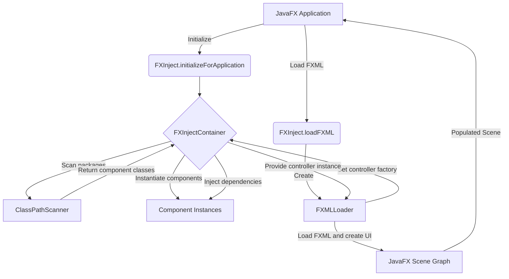

# 🚀 FXInject - JavaFX Apps with Easy Dependency Injection

FXInject is a lightweight, powerful dependency injection framework designed specifically for JavaFX applications. It simplifies your code, promotes modularity, and makes your JavaFX projects more maintainable.

## ✨ Features

- 🧩 Simple annotation-based dependency injection
- 🔗 Seamless integration with JavaFX
- 🎛️ Minimal configuration required
- 💉 Supports field-level injection
- 🔍 Automatic component scanning
- 📄 FXML integration

## 🛠️ Installation

Add to your `pom.xml`:

```xml
<dependency>
    <groupId>com.fxinject</groupId>
    <artifactId>fxinject</artifactId>
    <version>1.0.0</version>
</dependency>

<repositories>
    <repository>
        <id>github</id>
        <name>GitHub KIBUTI-BOT Apache Maven Packages</name>
        <url>https://maven.pkg.github.com/KIBUTI-BOT/FXInject</url>
    </repository>
</repositories>
```

## 🔄 How It Works



## 🚀 Quick Start

1. Mark components:

```java
@Component
public class UserService {
    // Service implementation
}

@Component
public class MainController {
    @Inject
    private UserService userService;
    
    @FXML
    private void initialize() {
        // Controller initialization
    }
}
```

2. Setup in main application:

```java
public class MainApplication extends Application {
    @Override
    public void start(Stage primaryStage) {
        FXInjectContainer container = FXInject.createContainer();
        container.scan();
        
        FXMLDILoader loader = FXInject.createFXMLLoader(container);
        Parent root = loader.load(getClass().getResource("/fxml/main.fxml"));
        primaryStage.setScene(new Scene(root));
        primaryStage.show();
    }
}
```

## ⚠️ Important Note

If you're using the Java Platform Module System (JPMS), update your `module-info.java`:

```java
module your.module.name {
    requires javafx.controls;
    requires javafx.fxml;
    requires fxinject;

    opens your.package.name to javafx.fxml, fxinject;
    exports your.package.name;
}
```

This ensures FXInject can access your classes for dependency injection.

## 📚 Example

For a complete example, visit our [GitHub repository](https://github.com/KIBUTI-BOT/FXInject/tree/main/example).

## 🤝 Contributing

We welcome contributions to FXInject! Here's how you can help:

1. **Fork the Repository**: Start by forking the [FXInject repository](https://github.com/KIBUTI-BOT/FXInject) on GitHub.

2. **Clone Your Fork**: 
   ```
   git clone https://github.com/your-username/FXInject.git
   ```

3. **Create a Branch**: 
   ```
   git checkout -b feature/your-feature-name
   ```

4. **Make Your Changes**: Implement your feature or bug fix.

5. **Test Your Changes**: Ensure your changes don't break any existing functionality.

6. **Commit Your Changes**:
   ```
   git commit -m "Add a brief description of your changes"
   ```

7. **Push to Your Fork**:
   ```
   git push origin feature/your-feature-name
   ```

8. **Submit a Pull Request**: Go to the FXInject repository and submit a pull request with a clear description of your changes.

### Reporting Issues

If you find a bug or have a suggestion for improvement:

1. Check if the issue already exists in the [issue tracker](https://github.com/KIBUTI-BOT/FXInject/issues).
2. If not, create a new issue with a clear title and description.
3. Include steps to reproduce the issue if it's a bug.

Thank you for contributing to FXInject! 🎉

## 🔗 Useful Links

- [📦 GitHub Repository](https://github.com/KIBUTI-BOT/FXInject)
- [📖 Documentation](https://github.com/KIBUTI-BOT/FXInject/wiki)
- [🐛 Issue Tracker](https://github.com/KIBUTI-BOT/FXInject/issues)

